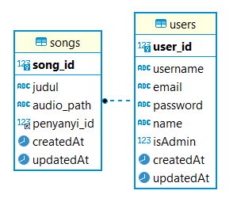

# Milestone 2 IF3110 Pengembangan Aplikasi Berbasis Web

## Deskripsi REST Service
REST Service dibuat sebagai Server Backend dari Aplikasi Sepotipayi Premium APP. Menggunakan ExpressJS dengan JWT untuk autentikasi dan MySQL (Sequelize) sebagai database.

## Daftar Endpoint

1. **POST** /auth/signin
2. **POST** /auth/signout
3. **POST** /auth/signup
4. **GET** /test/all
5. **GET** /test/user
6. **GET** /test/admin
7. **POST** /songs
8. **GET** /songs?id=X&penyanyi_id=X
9. **GET** /songs/user
10. **GET** /songs/subscription?subscriberId=X
11. **PATCH** /songs
12. **DELETE** /songs?id=X
13. **GET** /users
14. **GET** /subscription
15. **PATCH** /subscription

## Cara Menjalankan Server (Standalone)
> Perlu diperhatikan bahwa terdapat repository https://github.com/apwic/spotify-docker-script untuk mempermudah menjalankan aplikasi secara sekaligus dan **disarankan** untuk menjalankan server melewati repository tersebut.

1. Pastikan docker desktop sudah dijalankan, disarankan untuk melakukan delete terlebih dahulu pada image MySQL yang sudah dimiliki sebelumnya
2. Jalankan perintah `docker-compose up --build`
3. Buka browser dan ketikkan `localhost:1356` pada address bar untuk melihat web yang dibuat

> Untuk melihat daftar port pada docker, jalankan perintah dapat dilihat pada aplikasi docker desktop sesuai dengan container yang dijalankan

## Skema Database

## Pembagian Tugas
- Authorization: 13520044
- Songs: 13520044, 13520083, 13520101
- Users: 13520044, 13520083, 13520101
- Subscription: 13520044, 13520083
